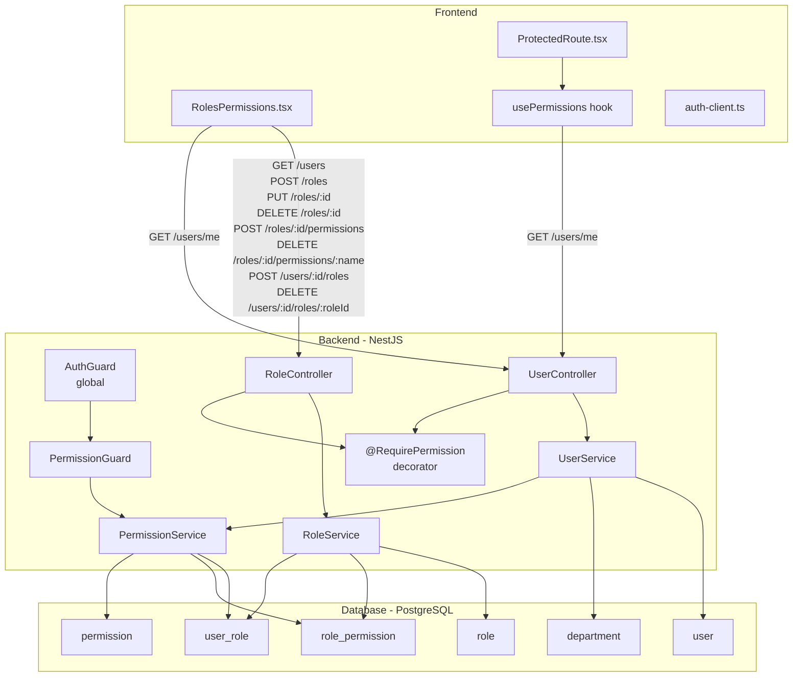

# Design Document — Roles & Permissions

## Overview

This feature replaces the flat `role: text` string on the `user` table with a full, permission-based access-control system. The design adds four new database tables (`role`, `permission`, `role_permission`, `user_role`), a new NestJS `RoleModule`, a reusable `PermissionGuard` + `@RequirePermission` decorator, updated user endpoints, and a rewritten frontend management UI.

### Key design decisions

- **Flat permission model, no hierarchy.** Permissions are static string constants. Roles are bags of permissions. A user's effective permission set is the union of all permissions held by their assigned roles.
- **Preserve `user.role` text column.** The `better-auth` admin plugin writes to this column. It is kept as-is. The guard uses it only to grant instant bypass to the `admin` value — no other logic depends on it.
- **Admin role is a system role.** It is seeded at startup, has `isSystem = true`, holds all 13 permissions, and is protected from all mutation.
- **13 static permissions are code-level constants.** They are seeded into the `permission` table on first startup; no new permissions can be introduced at runtime.
- **Single source of permission resolution.** The `PermissionService` is the only place that computes a user's effective permissions. It is used by the guard, by `GET /users/me`, and internally by the role module.

---

## Architecture



### Request flow for a permission-protected endpoint

```
Client Request
  → AuthGuard (validates session, populates req.user)
  → PermissionGuard (reads @RequirePermission metadata)
      → if user.role === 'admin': bypass, continue
      → else: PermissionService.resolvePermissions(userId)
              → query user_role + role_permission joins
              → return Set<string>
      → if required permission in Set: continue
      → else: throw ForbiddenException
  → Route handler
```

---

## Components and Interfaces

### Backend — NestJS module structure

```
src/
  role/
    role.module.ts
    role.controller.ts
    role.service.ts
    permission.service.ts
    permission.constants.ts     ← PERMISSIONS array and PermissionName type
    decorators/
      require-permission.decorator.ts
    guards/
      permission.guard.ts
    dto/
      create-role.dto.ts
      update-role.dto.ts
      assign-permission.dto.ts
      assign-user-role.dto.ts
  user/
    user.controller.ts          ← updated: GET /users/me adds permissions, GET /users adds roles
    user.service.ts             ← updated: findMeWithDepartment returns permissions
    user.module.ts              ← imports RoleModule for PermissionService
```

### `permission.constants.ts`

```typescript
export const PERMISSIONS = [
  'create_request',
  'approve_request_initial',
  'approve_request_final',
  'process_canvass',
  'approve_canvass',
  'generate_po',
  'receive_goods',
  'manage_users',
  'manage_roles_permissions',
  'manage_departments',
  'override_approvals',
  'view_all_records',
  'system_configuration',
] as const;

export type PermissionName = (typeof PERMISSIONS)[number];
```

### `require-permission.decorator.ts`

```typescript
import { SetMetadata } from '@nestjs/common';
export const PERMISSION_KEY = 'requiredPermission';
export const RequirePermission = (permission: PermissionName) =>
  SetMetadata(PERMISSION_KEY, permission);
```

### `PermissionGuard`

Implements `CanActivate`. Logic:

1. Read `PERMISSION_KEY` metadata from handler via `Reflector`. If absent → `return true`.
2. Extract `req.user` from the execution context. If absent → throw `UnauthorizedException`.
3. If `req.user.role === 'admin'` → `return true` (fast path).
4. Call `PermissionService.resolvePermissions(req.user.id)`.
5. If resolved set contains the required permission → `return true`.
6. Throw `ForbiddenException`.

### `PermissionService`

```typescript
async resolvePermissions(userId: string): Promise<Set<PermissionName>>
async resolveAllPermissions(): Promise<PermissionName[]>  // returns the 13 constants
```

`resolvePermissions` performs a single JOIN query:
```sql
SELECT p.name
FROM user_role ur
JOIN role_permission rp ON rp.role_id = ur.role_id
JOIN permission p       ON p.id       = rp.permission_id
WHERE ur.user_id = $1
```

### `RoleService`

| Method | Description |
|---|---|
| `listRoles()` | Returns all roles with their permission names |
| `createRole(name, description?)` | Creates custom role; 409 if name taken (case-insensitive) |
| `updateRole(id, name?, description?)` | Updates custom role; 403 if system; 400 if name invalid |
| `deleteRole(id)` | Deletes custom role + cascades; 403 if system |
| `assignPermission(roleId, permissionName)` | Upserts role_permission; 403 if admin; 400 if invalid perm |
| `revokePermission(roleId, permissionName)` | Removes role_permission; 403 if admin; ignores if absent |
| `assignUserRole(userId, roleId)` | Upserts user_role; 403 if target is admin |
| `revokeUserRole(userId, roleId)` | Removes user_role; 403 if target is admin; ignores if absent |

### `RoleController` — REST API

| Method | Path | Permission required | Description |
|---|---|---|---|
| `GET` | `/roles` | `manage_roles_permissions` | List all roles with permissions |
| `POST` | `/roles` | `manage_roles_permissions` | Create custom role |
| `PUT` | `/roles/:id` | `manage_roles_permissions` | Update custom role |
| `DELETE` | `/roles/:id` | `manage_roles_permissions` | Delete custom role |
| `POST` | `/roles/:id/permissions` | `manage_roles_permissions` | Assign permission to role |
| `DELETE` | `/roles/:id/permissions/:name` | `manage_roles_permissions` | Revoke permission from role |
| `POST` | `/users/:userId/roles` | `manage_roles_permissions` | Assign role to user |
| `DELETE` | `/users/:userId/roles/:roleId` | `manage_roles_permissions` | Revoke role from user |

### Updated `UserController`

- `GET /users/me` — adds `permissions: string[]` to response (all 13 for admin, union of role permissions otherwise).
- `GET /users` — now requires `manage_users` OR `manage_roles_permissions` permission; adds `roles: {id, name}[]` per user.

### Frontend components

| File | Changes |
|---|---|
| `RolesPermissions.tsx` | Full rewrite — tabbed UI: Roles tab (role list, create/delete, permission checkboxes), Users tab (user list, role assignment) |
| `ProtectedRoute.tsx` | Accepts optional `requiredPermission` prop; uses `usePermissions` hook |
| `usePermissions.ts` | New hook — reads from session/me endpoint, exposes `hasPermission(name)` |
| `auth-client.ts` | No changes required |

---

## Data Models

### Drizzle schema additions (`src/auth/schema.ts`)

```typescript
import { pgTable, text, boolean, timestamp, primaryKey, index } from 'drizzle-orm/pg-core';

// ── New tables ────────────────────────────────────────────────────────────────

export const role = pgTable('role', {
  id:          text('id').primaryKey(),
  name:        text('name').notNull().unique(),
  description: text('description'),
  isSystem:    boolean('is_system').default(false).notNull(),
  createdAt:   timestamp('created_at').defaultNow().notNull(),
  updatedAt:   timestamp('updated_at').defaultNow().$onUpdate(() => new Date()).notNull(),
});

export const permission = pgTable('permission', {
  id:          text('id').primaryKey(),
  name:        text('name').notNull().unique(),
  description: text('description'),
  createdAt:   timestamp('created_at').defaultNow().notNull(),
  updatedAt:   timestamp('updated_at').defaultNow().$onUpdate(() => new Date()).notNull(),
});

export const rolePermission = pgTable(
  'role_permission',
  {
    roleId:       text('role_id').notNull().references(() => role.id, { onDelete: 'cascade' }),
    permissionId: text('permission_id').notNull().references(() => permission.id, { onDelete: 'cascade' }),
  },
  (t) => [primaryKey({ columns: [t.roleId, t.permissionId] })],
);

export const userRole = pgTable(
  'user_role',
  {
    userId: text('user_id').notNull().references(() => user.id, { onDelete: 'cascade' }),
    roleId: text('role_id').notNull().references(() => role.id, { onDelete: 'cascade' }),
  },
  (t) => [
    primaryKey({ columns: [t.userId, t.roleId] }),
    index('user_role_userId_idx').on(t.userId),
  ],
);

// ── New Drizzle relations ─────────────────────────────────────────────────────

export const roleRelations = relations(role, ({ many }) => ({
  rolePermissions: many(rolePermission),
  userRoles:       many(userRole),
}));

export const permissionRelations = relations(permission, ({ many }) => ({
  rolePermissions: many(rolePermission),
}));

export const rolePermissionRelations = relations(rolePermission, ({ one }) => ({
  role:       one(role,       { fields: [rolePermission.roleId],       references: [role.id] }),
  permission: one(permission, { fields: [rolePermission.permissionId], references: [permission.id] }),
}));

export const userRoleRelations = relations(userRole, ({ one }) => ({
  user: one(user, { fields: [userRole.userId], references: [user.id] }),
  role: one(role, { fields: [userRole.roleId], references: [role.id] }),
}));

// ── userRelations — extend existing ──────────────────────────────────────────
// Add userRoles: many(userRole) to the existing userRelations definition
```

### Drizzle migration strategy

The new tables are introduced as a single migration `0003_roles_permissions.sql`, generated via `drizzle-kit generate` after updating `schema.ts`. The migration is purely additive:

1. `CREATE TABLE role` — no FK dependencies on existing tables.
2. `CREATE TABLE permission` — independent.
3. `CREATE TABLE role_permission` — FKs to `role` and `permission`.
4. `CREATE TABLE user_role` — FKs to `user` and `role`.

The existing `user.role` text column is not modified. No existing data is affected.

After running `drizzle-kit generate`, the generated SQL should be reviewed to confirm:
- `ON DELETE CASCADE` is present on both FK columns of `role_permission` and `user_role`.
- `UNIQUE` constraint on `role.name` and `permission.name`.
- `is_system` column default is `false`.

Migration is applied via `drizzle-kit migrate` as part of the normal deploy pipeline.

### DatabaseModule update

The `DatabaseModule` passes the schema to `drizzle(pool, { schema })`. After adding the four new tables and their relations to `schema.ts`, the module automatically picks them up — no changes to `database.module.ts` are needed.

### Response DTOs

**`GET /users/me` response:**
```typescript
{
  id: string;
  name: string;
  email: string;
  role: string;           // better-auth text field ('admin' | custom string)
  departmentId: string | null;
  departmentName: string | null;
  permissions: string[];  // NEW — resolved effective permissions
}
```

**`GET /users` response (per item):**
```typescript
{
  id: string;
  name: string;
  email: string;
  role: string;
  image: string | null;
  departmentId: string | null;
  departmentName: string | null;
  roles: { id: string; name: string }[];  // NEW — assigned custom roles
}
```

**`GET /roles` response (per item):**
```typescript
{
  id: string;
  name: string;
  description: string | null;
  isSystem: boolean;
  permissions: string[];   // permission name strings
}
```

### Seed script additions (`src/seed.ts`)

The seed script is extended to run these steps after the existing department and superadmin seeding, in this order:

1. **Seed permissions** — for each of the 13 `PERMISSIONS` constants, `INSERT ... ON CONFLICT (name) DO NOTHING`. Log created/skipped for each.
2. **Seed admin role** — `INSERT INTO role (id, name, is_system) VALUES (..., 'admin', true) ON CONFLICT (name) DO UPDATE SET is_system = true`. Log outcome.
3. **Assign all permissions to admin role** — for each of the 13 permissions, `INSERT INTO role_permission (role_id, permission_id) ... ON CONFLICT DO NOTHING`. Log created/skipped for each.
4. **Link superadmin user to admin role** — look up both user and role by known identifiers, then `INSERT INTO user_role (user_id, role_id) ... ON CONFLICT DO NOTHING`. Log outcome.

All steps use `ON CONFLICT ... DO NOTHING` so re-running is always safe.

---

## Correctness Properties

*A property is a characteristic or behavior that should hold true across all valid executions of a system — essentially, a formal statement about what the system should do. Properties serve as the bridge between human-readable specifications and machine-verifiable correctness guarantees.*

### Redundancy Analysis

Before finalising, reviewing for redundancy:

- Properties about invalid permission name input (1.5, 5.8 from prework) can be unified into one property: "for any string not in the 13 valid names, the guard/service returns a denial/error". This covers both the guard path and the assignment path.
- Properties about guard allow/deny (7.3, 7.4) are complementary halves of the same invariant and should be kept separate for clarity.
- The idempotent assign (5.3) and idempotent user-role assign (6.3) are the same structural property applied to different tables — unify as "idempotent assignment".
- The idempotent revoke (5.4) and (6.4) can similarly be unified.
- Role name validation (4.4) covers the 400 Bad Request rejection — keep with role creation property.
- Permission resolution (7.2, 8.1) both test the same underlying `resolvePermissions` function — unify.

After reflection, the canonical property set is:

---

### Property 1: Invalid permission strings are rejected by the guard

*For any* string value that is not one of the 13 defined permission names, when that string is presented to the `PermissionGuard` as the required permission (via `@RequirePermission`), the guard SHALL deny the request regardless of the requesting user's actual permissions.

**Validates: Requirements 1.5**

---

### Property 2: Permission resolution is the union of role permissions

*For any* user assigned to any non-empty set of roles, each carrying any non-overlapping or overlapping set of permissions, `PermissionService.resolvePermissions(userId)` SHALL return exactly the union of all permissions held by all of that user's assigned roles — no more, no fewer.

**Validates: Requirements 7.2, 8.1**

---

### Property 3: PermissionGuard enforces required permission

*For any* required permission P and any user whose resolved permission set does NOT contain P, the `PermissionGuard` SHALL return `false` (403 Forbidden). Conversely, for any user whose resolved permission set DOES contain P, the guard SHALL return `true` (allow).

**Validates: Requirements 7.3, 7.4**

---

### Property 4: Admin role is protected from all mutations

*For any* update payload (arbitrary name, description values) or delete request targeting the `admin` role (i.e., the role with `isSystem = true`), `RoleService` SHALL return a 403 Forbidden response and leave the role record unchanged.

**Validates: Requirements 2.4, 2.5**

---

### Property 5: Admin role permissions are protected from revocation

*For any* of the 13 static permission names, a request to revoke that permission from the admin role SHALL be rejected with 403 Forbidden and the role_permission record SHALL remain in place.

**Validates: Requirements 2.6, 5.5**

---

### Property 6: Role name uniqueness (case-insensitive)

*For any* existing role name N (in any mix of upper/lower case), a request to create a new role with a name that is case-insensitively equal to N SHALL be rejected with 409 Conflict and no new role record SHALL be created.

**Validates: Requirements 4.2**

---

### Property 7: Role name length validation

*For any* name string with length 0 (empty after trimming) or length greater than 100 characters, a request to create or update a role using that name SHALL be rejected with 400 Bad Request.

**Validates: Requirements 4.1, 4.4**

---

### Property 8: Idempotent permission assignment

*For any* role R and any permission P already assigned to R, calling `assignPermission(R, P)` again SHALL return a success response and the count of `role_permission` records for that role SHALL remain unchanged.

**Validates: Requirements 5.3**

---

### Property 9: Idempotent permission revocation

*For any* role R and any permission P not currently assigned to R, calling `revokePermission(R, P)` SHALL return a success response and no `role_permission` records SHALL be deleted.

**Validates: Requirements 5.4**

---

### Property 10: Idempotent user-role assignment

*For any* non-admin user U and role R already assigned to U, calling `assignUserRole(U, R)` again SHALL return a success response and the count of `user_role` records for that user SHALL remain unchanged.

**Validates: Requirements 6.3**

---

### Property 11: Idempotent user-role revocation

*For any* non-admin user U and role R not currently held by U, calling `revokeUserRole(U, R)` SHALL return a success response and no `user_role` records SHALL be deleted.

**Validates: Requirements 6.4**

---

### Property 12: GET /users/me response shape is preserved

*For any* authenticated user, the response from `GET /users/me` SHALL always contain all six existing fields (`id`, `name`, `email`, `role`, `departmentId`, `departmentName`) plus the new `permissions` array — no existing field is absent regardless of the user's role or permission state.

**Validates: Requirements 8.4**

---

### Property 13: GET /users roles array matches user_role table

*For any* non-admin user U in the system, the `roles` array returned for U in `GET /users` SHALL contain exactly the set of roles recorded in the `user_role` table for that user — no extra roles, no missing roles.

**Validates: Requirements 9.1**

---

## Error Handling

| Scenario | HTTP status | Details |
|---|---|---|
| No session on request to protected endpoint | 401 Unauthorized | Thrown by `PermissionGuard` before permission check |
| User lacks required permission | 403 Forbidden | Thrown by `PermissionGuard` |
| Attempt to modify admin role | 403 Forbidden | Thrown by `RoleService` |
| Attempt to assign/revoke role on admin user | 403 Forbidden | Thrown by `RoleService` |
| Role not found | 404 Not Found | Thrown by `RoleService` |
| User not found | 404 Not Found | Thrown by `RoleService` |
| Role name already exists (create/rename) | 409 Conflict | Thrown by `RoleService` |
| Invalid role name (empty or >100 chars) | 400 Bad Request | Thrown by `RoleService` after DTO validation |
| Invalid permission name | 400 Bad Request | Thrown by `RoleService` (checked against `PERMISSIONS` constant) |
| DB error in permission resolution | 500 Internal Server Error | NestJS default exception filter; not swallowed |

**Guard ordering:** The global `AuthGuard` from `@thallesp/nestjs-better-auth` runs before `PermissionGuard`. If `AuthGuard` rejects the request (invalid token), `PermissionGuard` never executes. `PermissionGuard` is registered per-module (not globally) so that endpoints without `@RequirePermission` have zero overhead.

**DTO validation:** `class-validator` decorators on DTOs handle syntactic validation (string, length). Business-rule validation (isSystem check, name uniqueness) is handled inside `RoleService`.

---

## Testing Strategy

### Unit tests (Jest)

Target the pure logic layer in isolation using in-memory mocks for the Drizzle database.

| Test file | What it covers |
|---|---|
| `permission.guard.spec.ts` | Properties 1, 3; admin bypass example; no-decorator pass-through; 401 on missing user |
| `permission.service.spec.ts` | Property 2 (union of permissions); empty role set → empty array |
| `role.service.spec.ts` | Properties 4–11; 404/409/400 error paths |
| `user.service.spec.ts` | Property 12 (response shape); admin user returns all 13 permissions; no-roles returns `[]` |

### Property-based tests (fast-check)

Property-based testing library: **[fast-check](https://fast-check.io/)** (TypeScript-native, zero extra deps, integrates directly with Jest).

Install: `npm install --save-dev fast-check`

Configuration: minimum **100 runs** per property (fast-check default). Each test is tagged with a comment referencing the design property.

| Property | Generator strategy |
|---|---|
| **Property 1** (invalid perm strings) | `fc.string()` filtered to exclude the 13 valid names |
| **Property 2** (permission union) | `fc.array(fc.subarray(PERMISSIONS, {minLength:0}))` — generate N roles each with a random subset of permissions |
| **Property 3** (guard allow/deny) | From Property 2 output, pick required permission at random; check both inclusion and exclusion |
| **Property 4** (admin role mutation) | `fc.record({ name: fc.string(), description: fc.option(fc.string()) })` — random update payloads |
| **Property 5** (admin perm revoke) | `fc.constantFrom(...PERMISSIONS)` |
| **Property 6** (name uniqueness) | `fc.string({ minLength: 1, maxLength: 100 })` — generate name, insert, then try variants with `fc.mixedCase()` |
| **Property 7** (name length) | `fc.oneof(fc.constant(''), fc.string({ minLength: 101 }))` |
| **Properties 8–11** (idempotence) | `fc.constantFrom(...PERMISSIONS)` and `fc.uuid()` for role/user IDs |
| **Property 12** (response shape) | `fc.record(...)` — generate random user state, call service method, assert all keys present |
| **Property 13** (user roles match) | `fc.array(fc.uuid(), {maxLength: 5})` — generate N roles assigned to user, verify list matches |

**Tag format:** Each property test function must include a comment:
```
// Feature: roles-permissions, Property N: <property_text>
```

### Integration tests

Integration tests run against a real PostgreSQL instance (can use a test container or a local test database).

| Scope | Approach |
|---|---|
| Migration | Apply migration 0003, assert all four tables exist and are queryable |
| Seed idempotence | Run seed script twice; assert no duplicate permissions, roles, or user-role records |
| Guard + controller stack | Use NestJS `Test.createTestingModule` with real DB; verify full request lifecycle |
| Admin fast-path | Verify admin user bypasses DB join in permission resolution |

### Frontend tests

The frontend does not currently have a test suite. For this feature:

- `usePermissions` hook: mock `fetch` response, assert `hasPermission` returns correct booleans.
- `ProtectedRoute` with `requiredPermission` prop: snapshot test for access-denied screen when permission absent.
- `RolesPermissions.tsx` role/permission tab rendering: mock API responses, assert role rows, permission checkboxes state, and user-role assignment calls.

These are example-based tests using **Vitest** + **@testing-library/react** (already present in the frontend ecosystem as the standard Vite companion).
